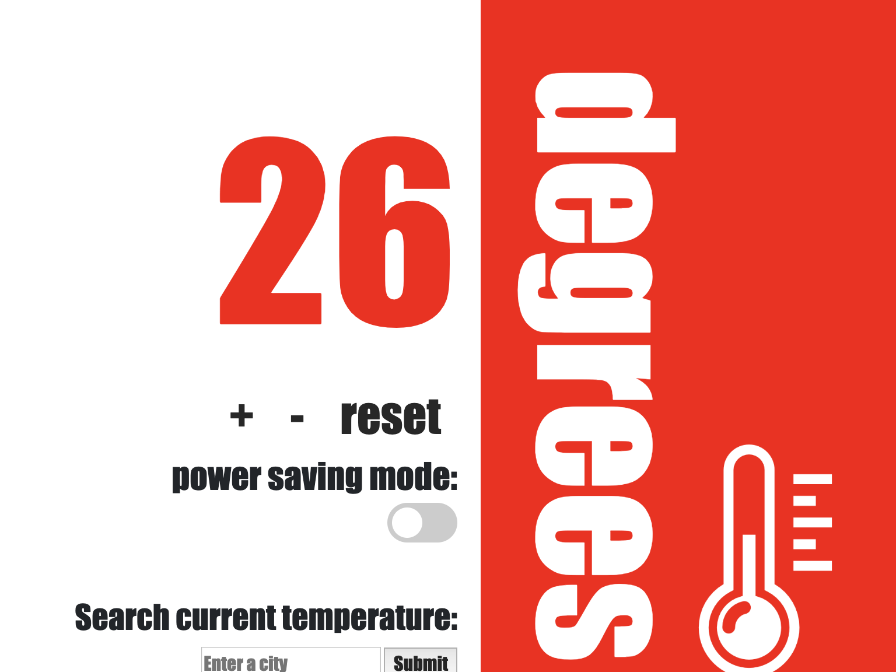

### [Makers Academy](http://www.makersacademy.com) - Week 5 Pair programming challenge 

# Thermostat 🌡️

#### Technologies: Javascript, Jasmine, Rspec, Sinatra, HTML, CSS, 

[Task](#Task) | [Installation Instructions](#Installation) | [Functional Description](#Functional_Description) | [Further improvements](#Further_Improvements) |



## <a name="Task">The Task</a>

Build the logic needed to model a simple thermostat.

This challenge is the fifth afternoon pair programming challenge at [Makers Academy](https://github.com/makersacademy).

## <a name="Installation">Installation Instructions</a>

1. Fork this repository, clone to your local machine then change into the directory:
```
$ git clone git@github.com:davmcgregor/thermostat-js.git
$ cd thermostat-js
```
2. Load dependencies with bundle:
```
$ gem install bundle
$ bundle
```
3. Run jasmine for tests and coverage
```
$ open SpecRunner.html
```
4. Run the app on a local server and use on the broswer: http://localhost:9292

```Shell
$ rackup
```

## <a name="Functional_Description">Functional Description</a>

* Thermostat starts at 20 degrees
* You can increase the temperature with an up function
* You can decrease the temperature with a down function
* The minimum temperature is 10 degrees
* If power saving mode is on, the maximum temperature is 25 degrees
* If power saving mode is off, the maximum temperature is 32 degrees
* Power saving mode is on by default
* You can reset the temperature to 20 with a reset function
* You can ask about the thermostat's current energy usage: < 18 is low-usage, < 25 is medium-usage, anything else is high-usage.
 * Use a jQuery AJAX call to get the weather information for London from a weather API. Display the weather information to the user.
 * Add further functionality so that the user can select their current city and the weather provided is for the selected city.

 ## <a name="Further_Improvements">Further Improvements</a>
* Store state in sinatra using json/javascript: [Example 1](https://stackoverflow.com/questions/36343170/how-to-store-state-using-in-sinatra-using-json-javascript-without-databases, [Example 2](https://github.com/nadavmatalon/thermostat)